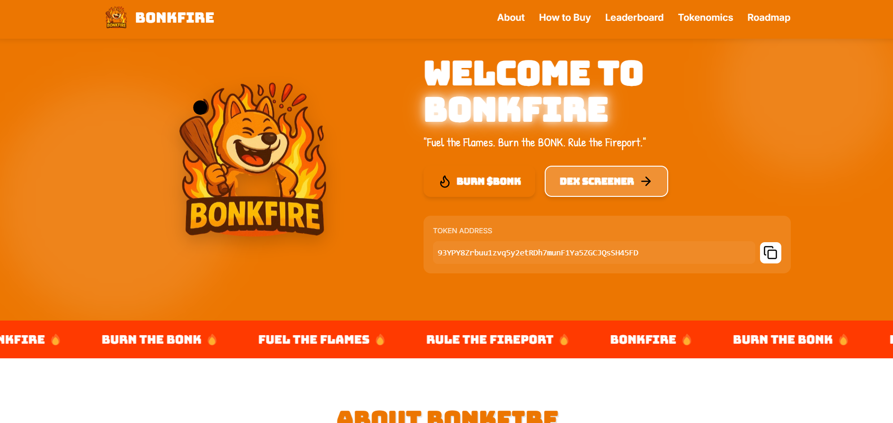

# BONKFIRE



## "Fuel the Flames. Burn the BONK. Rule the Fireport."

BONKFIRE is the ultimate meme movement on Solana. Built for believers who know that sometimes the best way forward is to set it all on fire and start fresh.

**Token Address:** `93YPY8Zrbuu1zvq5y2etRDh7munF1Ya5ZGCJQsSH45FD`

[](https://nickdabizaz.github.io/bonkfire.github.io/)
[](https://jup.ag)
[](https://raydium.io)

## Project Overview

BONKFIRE is a revolutionary meme coin project built on the Solana blockchain featuring an innovative burn mechanism that allows users to convert their $BONK into $BONKFIRE, fueling community growth while reducing $BONK supply.

This repository contains the landing page serving as the official website for the BONKFIRE brand, offering users information about the token, how to buy it, tokenomics, roadmap, and the burn leaderboard.

## Key Features

- **Revolutionary Burn Mechanism**: Convert $BONK into $BONKFIRE, reducing supply while growing the ecosystem
- **Burn Leaderboard**: Track top wallets burning $BONK, encouraging community participation
- **Clear Tokenomics**: Transparent distribution of the 1,000,000,000,000 total supply
- **Comprehensive Roadmap**: Four-phase development plan from launch to ecosystem expansion
- **Interactive UI**: Modern, responsive design with engaging visuals and smooth animations

## Technology Stack

- **HTML5**: Semantic structure and accessibility
- **CSS3**: Advanced styling with animations and responsive design
- **JavaScript**: Interactive elements and dynamic content loading
- **Solana Blockchain**: Foundation for the token and burn mechanism

## Tokenomics

- **Total Supply**: 1,000,000,000,000
- **Liquidity**: 50%
- **Marketing**: 10%
- **Team**: 10%
- **Burn Pool**: 20%
- **Community**: 10%

## Roadmap

### 1. LAUNCH & INITIAL GROWTH
- Website launch
- Social media setup
- Initial token distribution
- Liquidity providing

### 2. COMMUNITY BUILDING
- Community events
- Marketing campaigns
- Partnerships
- Burn mechanism implementation

### 3. UTILITY DEVELOPMENT
- NFT collection launch
- Staking platform
- Community governance
- Enhanced burn rewards

### 4. ECOSYSTEM EXPANSION
- dApp development
- Cross-chain integration
- Major exchange listings
- Real-world utility projects

## How to Buy $BONKFIRE

1. **Create a Wallet**: Download Phantom or Solflare wallet and set it up
2. **Get SOL**: Buy SOL from an exchange and send it to your wallet
3. **Connect to DEX**: Visit Jupiter or Raydium and connect your wallet
4. **Swap for $BONKFIRE**: Swap your SOL for $BONKFIRE tokens

## Installation & Development

```bash
# Clone the repository
git clone https://github.com/yourusername/bonkfire-landing-page.git

# Navigate to project directory
cd bonkfire-landing-page

# Open in browser
open index.html
```

## Future Development

- **Web3 Integration**: Direct token purchases through the website
- **NFT Integration**: Launch of exclusive BONKFIRE NFT collection
- **Advanced Burn Mechanics**: Enhanced burn rewards and gamification
- **Governance System**: Community-driven decision making
- **Mobile App**: Native mobile experience for the BONKFIRE ecosystem

## Connect With Us

- [Twitter](https://twitter.com/bonkfire)
- [Telegram](https://t.me/bonkfire)
- [Discord](https://discord.gg/bonkfire)

## License

This project is licensed under the MIT License - see the [LICENSE](LICENSE) file for details.

---

© 2025 BONKFIRE. All rights reserved.
"# bonkfire" 
